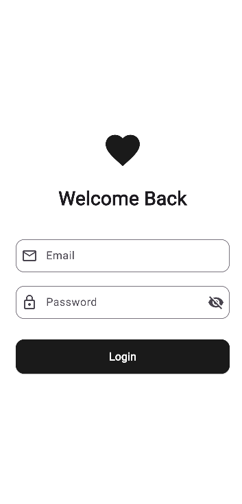

# Task 1 - Multi-Screen Mobile Application

Built a health tracking app called Pulse with three screens - a splash screen with loading animation, a login screen with email/password validation and show/hide toggle, and a home dashboard showing steps, heart rate and recent activities.

## Screenshots

| Login Screen | Home Dashboard |
|:---:|:---:|
|  |  |

## Setup
```
flutter clean
flutter pub get
```

## Run
```
flutter run
```
