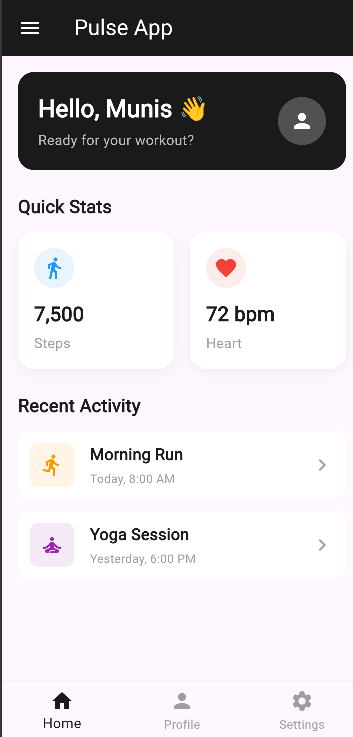
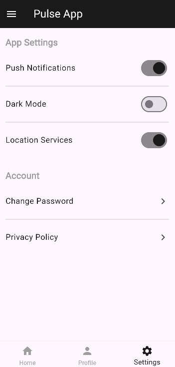
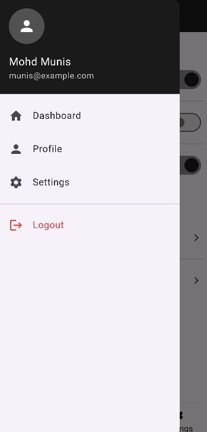

# Task 2 - Navigation Challenge

Added navigation on top of the multi-screen app. Implemented a bottom navigation bar with 3 tabs (Home, Profile, Settings), a side drawer with menu items and logout option, and state is preserved when switching between tabs using PageController.

## GitHub Repo
https://github.com/mohdmunis161/internship-appdev/tree/main/task2

## Screenshots

| Home with Nav | Settings Tab | Drawer Menu |
|:---:|:---:|:---:|
|  |  |  |

## Setup
```
flutter clean
flutter pub get
```

## Run
```
flutter run
```
