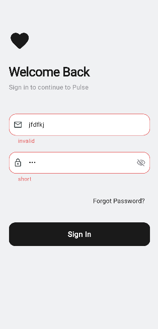
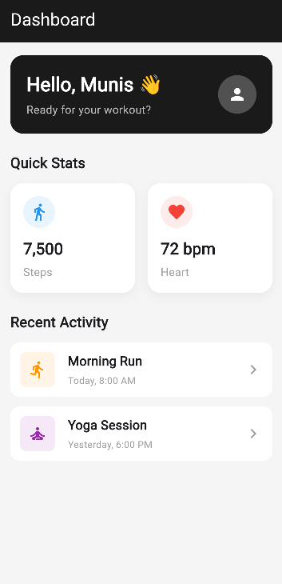

# Task 3 - UI Component Library

Refactored the entire app into a reusable component library. Created shared widgets like PulseButton, PulseTextField, PulseCard etc inside a widgets folder so they can be reused across any screen. Followed proper folder structure with features/, widgets/, models/ and theme/ separation.

## GitHub Repo
https://github.com/mohdmunis161/internship-appdev/tree/main/task3

## Screenshots

| Component Preview 1 | Component Preview 2 |
|:---:|:---:|
|  |  |

## Setup
```
flutter clean
flutter pub get
```

## Run
```
flutter run
```
