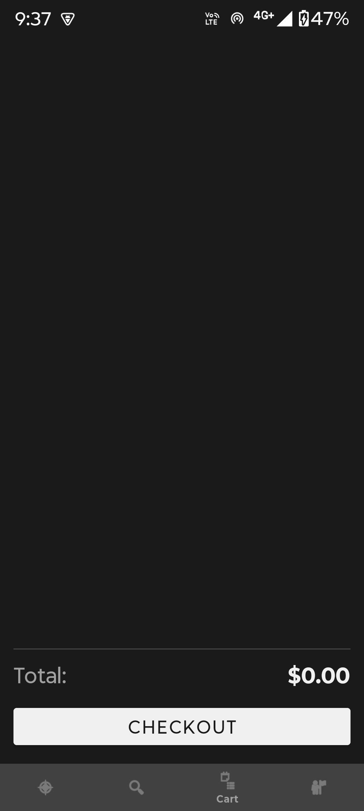
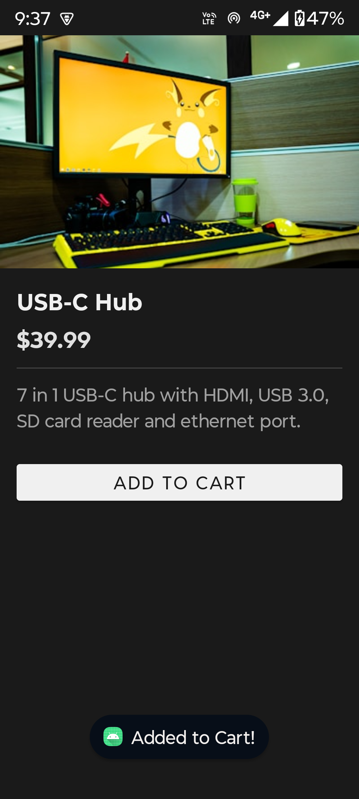
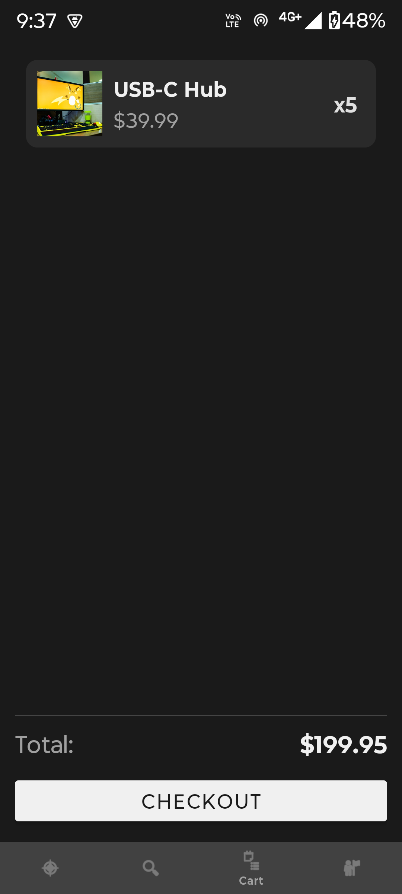
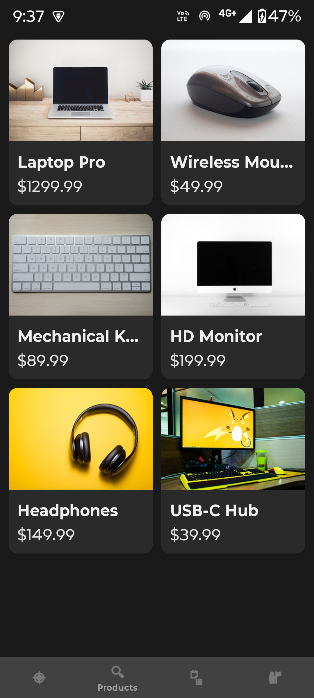
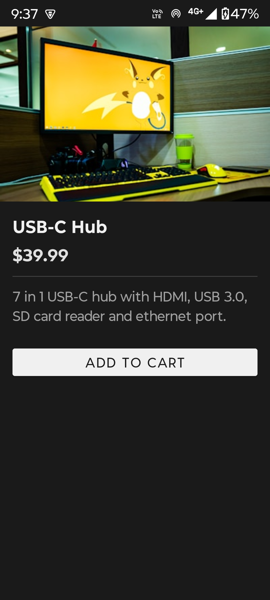
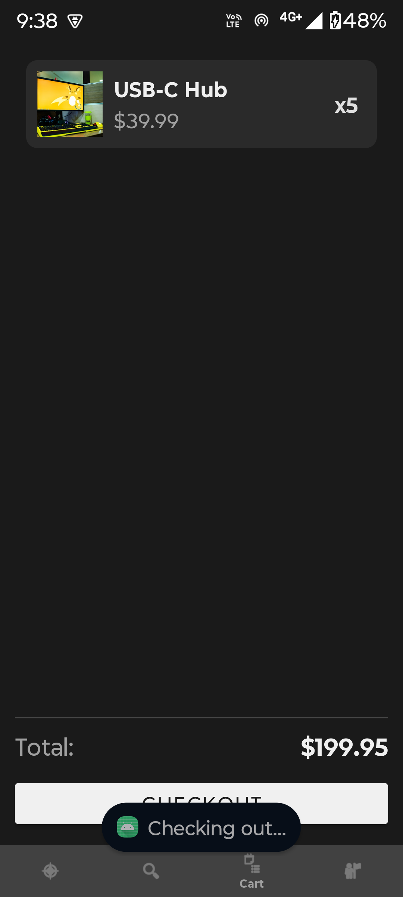

# E-Commerce App

A multi-screen e-commerce Android app built with Kotlin. This app has a splash screen, home page with product listings, product detail page, a cart, and a profile screen.

## Architecture

- **Language:** Kotlin
- **UI:** XML Layouts with ViewBinding
- **Navigation:** Jetpack Navigation Component (Single Activity, Multiple Fragments)
- **Pattern:** MVVM (ViewModel + LiveData)
- **Data:** Hardcoded dummy product list (no API)

### Project Structure

```
app/src/main/java/com/munis/e_commerceapp/
├── model/          # Data classes (Product, CartItem)
├── ui/             # Fragments (Home, ProductDetail, Cart, Profile, Splash)
├── theme/          # Adapter classes (CartAdapter, ProductAdapter)
├── viewmodel/      # SharedViewModel for cart logic
└── MainActivity.kt # Single activity host
```

## How to Run

1. Open the project in Android Studio
2. Let Gradle sync finish
3. Connect a device or start an emulator
4. Click the Run button

## Screenshots

| Splash & Home | Products & Detail | Cart & Profile |
|:---:|:---:|:---:|
|  |  |  |
|  |  |  |
|  |  |  |
