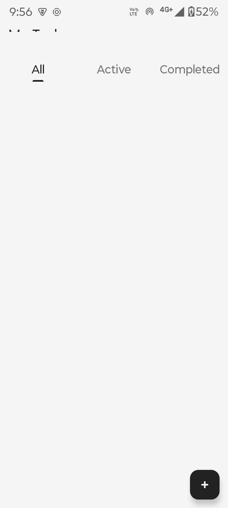
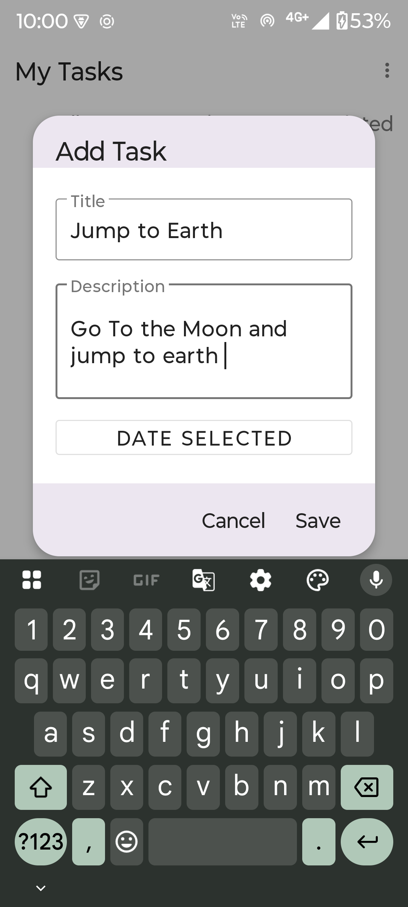
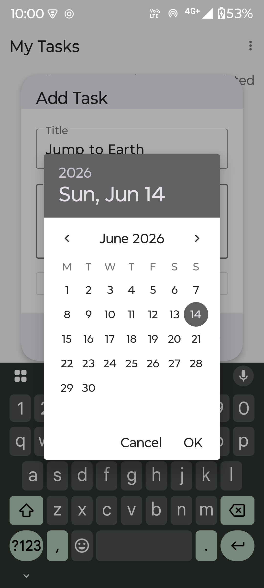
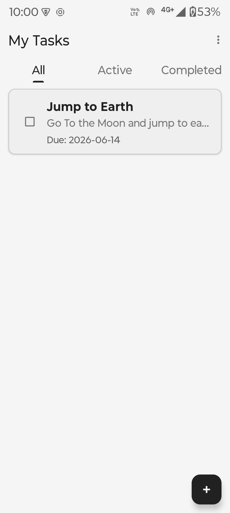
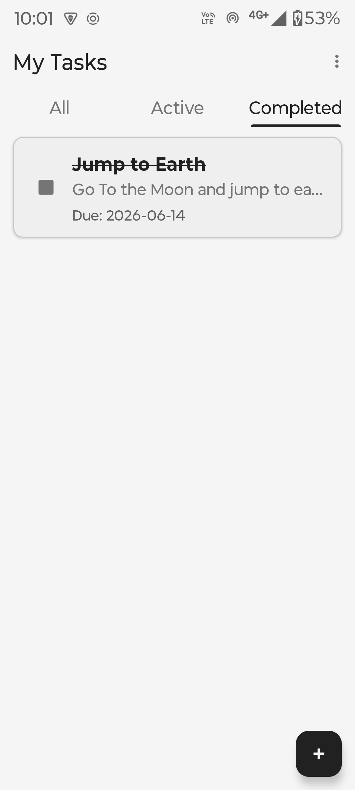
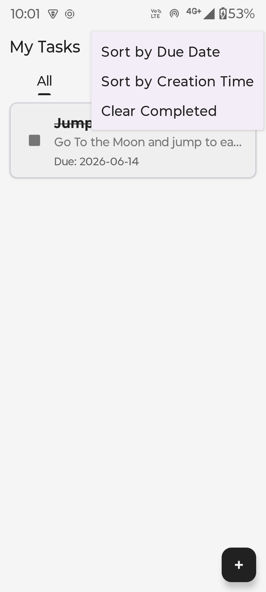
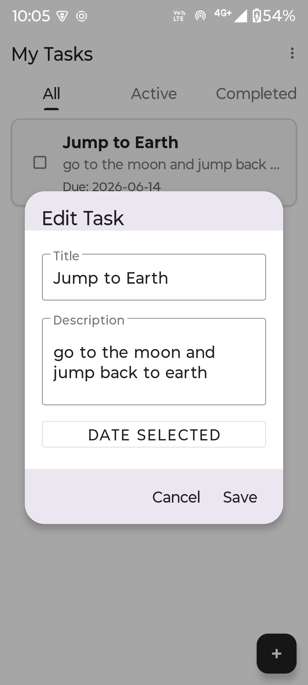
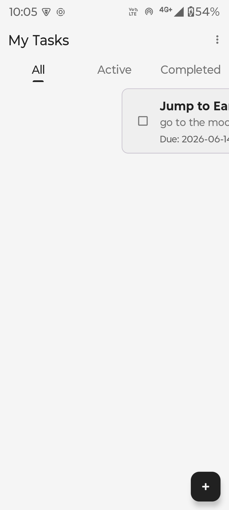

# ToDo App

A simple to-do list app for Android built with Kotlin. You can add tasks, edit them, mark as done, delete by swiping, and filter by status. All data is saved locally using Room database so tasks stay even after closing the app.

## Architecture

- **Language:** Kotlin
- **UI:** XML Layouts with ViewBinding
- **Storage:** Room Database (SQLite)
- **Pattern:** MVVM (ViewModel + LiveData + Repository)

### Project Structure

```
app/src/main/java/com/munis/todoapp/
├── data/           # Task entity, DAO, Database, Repository
└── ui/             # MainActivity, TaskAdapter, TaskViewModel
```

### How it works

- `Task.kt` is the data model stored in Room DB
- `TaskDao.kt` has all the database queries
- `TaskViewModel.kt` handles filtering, sorting, and talks to the repository
- `MainActivity.kt` sets up the RecyclerView, tabs, dialogs, and swipe-to-delete

## Features

- Add/Edit tasks using a popup dialog
- Pick due date with date picker
- Mark tasks complete (checkbox with strikethrough)
- Swipe left or right to delete
- Filter tasks: All / Active / Completed
- Sort by due date or creation time
- Clear all completed tasks from menu
- Data persists across app restarts

## How to Run

1. Open the project in Android Studio
2. Wait for Gradle sync
3. Connect a device or start an emulator
4. Hit Run

## Screenshots

| Main Screen | Add Task | Select Date |
|:---:|:---:|:---:|
|  |  |  |

| Task Added | Mark Complete | Active Tasks |
|:---:|:---:|:---:|
|  |  |  |

| Completed Tasks | Edit Task | Swipe Delete |
|:---:|:---:|:---:|
|  |  |  |
